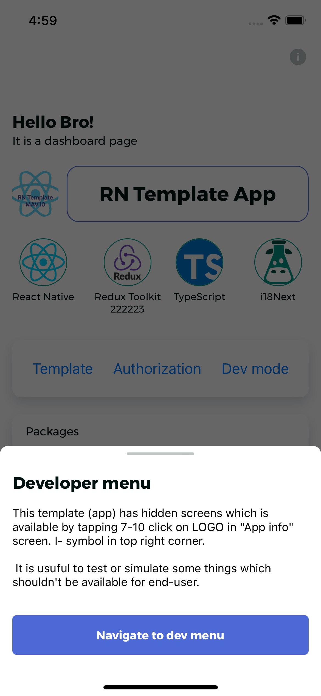

#  react-native-mav10-template

:keyboard: A custom corporate template to bootstrap React Native app with all the time-wasting packages and procedures
you need to have.

## Table of Contents

- [Installation](#installation)
- [Libraries Included](#libraries-included)
- [Screens](#screens)
- [Folder Structure](#folder-structure)
- [Run Scripts](#run-scripts)


## Installation

You can create a new project using RNTemplate by running the following command:

_It not fully done yet_

```
npx react-native init MyApp --template mav10/RNTemplate
```

## Libraries Included

RNTemplate has the following libraries and dependencies pre-installed:

- Synced with the
  recommended [TypeScript template](https://reactnative.dev/doc/typescript#getting-started-with-typescript)
- Added eslint and prettier support
- [Axios](https://github.com/axios/axios) for api calls
- [Axios auth refresh](https://github.com/Flyrell/axios-auth-refresh)  implement automatic refresh of authorization via
  axios interceptors
- [Date-FNS](https://date-fns.org/) toolset for manipulating JavaScript dates
- [React Query(tanstack)](https://github.com/tannerlinsley/react-query) for data fetching/caching over axios
- [React Navigation](https://reactnavigation.org/) for navigation and deeplinking.
- [Redux](https://github.com/reduxjs/redux) state management
- [Redux Toolkit](https://redux-toolkit.js.org/) - Official, opinionated, batteries-included toolset for efficient Redux
  development
- [redux-persist]() auto sync of state to async-storage (useful for storing auth token)
- [react-native-bootsplash](https://github.com/rt2zz/redux-persist) because splash screens are cool and needed (also
  provides CLI for generating splashes)
- [react-i18next](https://github.com/i18next/react-i18next) internationalization.
- [react-native-restart](https://github.com/avishayil/react-native-restart) helps to re-launch app if it stuck on
  ErrorBoundary
- [react-native-modal](https://github.com/react-native-modal/react-native-modal) provide famous MODAL component to use
  it in app
- [react-native-reanimated](https://docs.swmansion.com/react-native-reanimated/) For better animations and supports all
  features of navigation
- [react-native-safe-area-context](https://github.com/th3rdwave/react-native-safe-area-context) A flexible way to handle
  safe area (notches, bottom bars etc.)
- [@react-native-firebase/messaging](https://rnfirebase.io/) FCM - remote push notification over Firebase
- [Code Push](https://github.com/microsoft/react-native-code-push) synchronize JavaScript and Images with over-the-air
  updates.
- [Sentry](https://github.com/getsentry/sentry-react-native) for debugging in production.
- [react-native-config](https://github.com/luggit/react-native-config) for providing ENV variables
- [AsyncStorage](https://github.com/react-native-community/async-storage) you're gonna install it anyway.
- [NetInfo](https://github.com/react-native-netinfo/react-native-netinfo) Network Info API for Android, iOS, macOS &
  Windows.

## Screens
Template includes some dummy screens to demonstrate how to work with different types of components, navigations, localizations etc.

####Access dev menu
**password:** qwerty123

####Access to login
**username:** user <br />
**password:** user123

<table>
  <tr>
    <td>Splash Screen</td>
     <td>Dashboard</td>
     <td>Modals</td>
  </tr>
  <tr>
    <td></td>
    <td></td>
    <td></td>
  </tr>
  <tr>
     <td>Login Screen</td>
     <td>Profile Screen</td>
     <td>Notifications (not implemented)</td>
  </tr>
  <tr>
    <td></td>
    <td></td>
    <td></td>
  </tr>
<tr>
     <td>App info Screen</td>
     <td>Network error</td>
     <td>Dev menu Screen</td>
  </tr>
  <tr>
    <td></td>
    <td></td>
    <td></td>
  </tr>
 </table>


## Folder Structure

```
├── __tests__
│   └── App-test.tsx
├── android
├── assets
│   ├── animations
│   ├── fonts
│   └── images
├── ios
├── node_modules
├── src
│   ├── appInfrastructure
│   │   ├── analitics
│   │   │   ├── analitics-helper.ts
│   │   │   └── sentry-helper.ts
│   │   ├── code-push
│   │   │   ├── CodePushProvider.tsx
│   │   │   └── code-push.ts
│   │   ├── constants
│   │   │   └── asyncStorageKeys.ts
│   │   ├── hooks
│   │   │   ├── useAppRestoredFromBackground.ts
│   │   │   ├── useCustomBackBehaviour.tsx
│   │   │   ├── useModal.ts
│   │   │   ├── useNetworkState.tsx
│   │   │   ├── usePrevious.tsx
│   │   │   └── useToggleState.ts
│   │   ├── localisation
│   │   │   ├── LanguageProvider.tsx
│   │   │   ├── dictionaries
│   │   │   │   ├── de
│   │   │   │   │   ├── dev.json
│   │   │   │   │   └── localization.json
│   │   │   │   ├── en
│   │   │   │   │   ├── dev.json
│   │   │   │   │   └── localization.json
│   │   │   │   └── ru
│   │   │   │       ├── dev.json
│   │   │   │       └── localization.json
│   │   │   ├── i18next.d.ts
│   │   │   ├── languageDetector.ts
│   │   │   ├── locales.ts
│   │   │   ├── localization.ts
│   │   │   ├── react-i18next.d.ts
│   │   │   └── useScopedTranslation.ts
│   │   ├── logging
│   │   │   └── logging.ts
│   │   ├── push-notifications
│   │   │   ├── push-consumers.ts
│   │   │   ├── push-handlers.ts
│   │   │   └── useNotifications.tsx
│   │   └── redux-store
│   │       ├── persistence
│   │       │   ├── migrations.ts
│   │       │   └── persist-config.ts
│   │       ├── root-action.ts
│   │       ├── root-reducer.ts
│   │       ├── root-store.ts
│   │       └── store-types.ts
│   ├── commons
│   │   ├── blockContainer
│   │   │   ├── block.component.tsx
│   │   │   ├── block.d.ts
│   │   │   └── block.styles.ts
│   │   ├── buttons
│   │   │   ├── button.component.tsx
│   │   │   ├── button.d.ts
│   │   │   └── button.styles.ts
│   │   ├── card
│   │   │   ├── card.component.tsx
│   │   │   ├── card.d.ts
│   │   │   └── card.styles.ts
│   │   ├── informationScreenContainer
│   │   │   ├── informationScreenContainer.component.tsx
│   │   │   ├── informationScreenContainer.d.ts
│   │   │   └── informationScreenContainer.styles.ts
│   │   ├── input
│   │   │   ├── customTextInput.component.tsx
│   │   │   ├── customTextInput.d.ts
│   │   │   └── customTextInput.styles.ts
│   │   ├── modal
│   │   │   ├── modal.container.tsx
│   │   │   ├── modal.d.ts
│   │   │   └── modal.styles.ts
│   │   └── styles
│   │       ├── colors.ts
│   │       ├── fonts.ts
│   │       └── styles.ts
│   ├── components
│   │   ├── appInfoRow
│   │   │   ├── AppInfoRow.component.tsx
│   │   │   ├── appInfoRow.d.ts
│   │   │   └── appInfoeRow.styles.ts
│   │   ├── backButton
│   │   │   ├── backButton.component.tsx
│   │   │   └── backButton.styles.ts
│   │   ├── devModeButton
│   │   │   ├── devModeButton.component.tsx
│   │   │   ├── devModeButton.d.ts
│   │   │   ├── devModeButton.styles.ts
│   │   │   └── devModeLogout.component.tsx
│   │   ├── hintButton
│   │   │   ├── hintButton.component.tsx
│   │   │   └── hintButton.styles.ts
│   │   ├── languageSwitcher
│   │   │   ├── languageItem.component.tsx
│   │   │   ├── languageSwitcher.component.tsx
│   │   │   ├── languageSwitcher.d.ts
│   │   │   ├── languageSwitcher.styles.ts
│   │   │   └── languageSwitcherSeparator.tsx
│   │   ├── loaders
│   │   │   ├── loader.component.tsx
│   │   │   ├── loader.d.ts
│   │   │   └── loader.styles.ts
│   │   └── version
│   │       ├── version.component.tsx
│   │       ├── version.d.ts
│   │       └── version.styles.ts
│   ├── context
│   │   ├── ModalPresenter.context.ts
│   │   └── ModalPresenter.provider.tsx
│   ├── features
│   │   ├── app
│   │   │   ├── app-selectors.ts
│   │   │   ├── app-slice.ts
│   │   │   └── app-types.ts
│   │   └── auth
│   │       ├── auth-selectors.ts
│   │       ├── auth-slice.ts
│   │       └── auth-types.ts
│   ├── helpers
│   │   ├── app-helpers.ts
│   │   ├── axios-interceptors.ts
│   │   ├── date-helper.ts
│   │   └── storage-helper.ts
│   ├── navigation
│   │   ├── TabNavigation.tsx
│   │   ├── configuration
│   │   │   ├── TabBarIcon.tsx
│   │   │   ├── headers.tsx
│   │   │   ├── index.d.ts
│   │   │   ├── navigation.styles.ts
│   │   │   ├── navigators.tsx
│   │   │   ├── routeParams.ts
│   │   │   └── routes.ts
│   │   └── index.tsx
│   ├── screens
│   │   ├── Dashboard
│   │   │   ├── Dashboard.styles.ts
│   │   │   └── DashboardController.tsx
│   │   ├── Dev
│   │   │   ├── DevController.tsx
│   │   │   └── dev.styles.ts
│   │   ├── Info
│   │   │   ├── InfoController.tsx
│   │   │   └── infoController.styles.ts
│   │   ├── Login
│   │   │   ├── Login.styles.ts
│   │   │   └── LoginController.tsx
│   │   ├── NoConnection
│   │   │   └── NoConnectionController.tsx
│   │   ├── Profile
│   │   │   ├── Profile.styles.ts
│   │   │   └── ProfileController.tsx
│   │   ├── ReactNative
│   │   │   ├── ReactNativeScreen.styles.ts
│   │   │   └── ReactNativeScreen.tsx
│   │   ├── Splash
│   │   │   ├── Splash.styles.ts
│   │   │   └── SplashScreen.tsx
│   │   └─ NotImplementedScreen.tsx
│   ├── services
│   │   ├── api
│   │   │   └── api-client.ts
│   │   ├── client-service.ts
│   │   ├── index.ts
│   │   ├── navigation-service.ts
│   │   └── pushNotification-service.ts
│   ├─ types
│   │    ├── blob-options.d.ts
│   │    ├── jest-extended
│   │    │   └── index.d.ts
│   │    ├── react-native-config
│   │    │   └── index.d.ts
│   │    └── rn-flipper-async-storage-advanced.d.ts
│   ├── App.tsx
│   └── global.d.ts
├── tsconfig.json
└── yarn.lock
├── .buckconfig
├── .env
├── .eslinignore
├── .eslintrc.js
├── .gitignore
├── .prettierrc.js
├── app.json
├── babel.config.js
├── index.js
├── metro.config.js
├── package.json
├── react-native.config.js
└── yarn.lock
```

## Run Scripts

- `start` - Starts the Metro Bundler.
- `android` - Builds the app and starts it on an Android emulator.
- `ios` - Builds the app and starts it on an iOS simulator.
- `test` - Runs the Jest test runner on your tests.
- `lint` - Runs the linting tool on your code.
- `lint:fix` - Fixes the linting errors in your code.
- `build` - Builds the app for production.


